# 2025-WrapItUp-Planner
WrapItUp Planner is an All-In-One collaborative web platform designed to help students in managing their academic journey more efficiently. The application combines study organization, sharing knowledge and AI tools into a single place. Students can upload their notes which are processed using AI to generate overviews, summaries and interactive multiple choice questions to test their knowledge on a particular subject. Alongside this, an integrated interactive calendar with daily to-do lists and event scheduling is available to help students plan their time efficiently. This application means to foster academic collaboration by letting students share their AI generated notes and comment on them to create discussion. Overall WrapItUp Planner's goal is to simplify study management while also creating a community of students who value collaboration.

At this point in time only the functional and objectives have been defined; further development has not yet begun.

## Functional Objectives

WrapItUp Planner's main goal is to provide a collaborative platform where students can share and organize study materials. The application users are divided into three different categories, non-registered users, registered users and administrators, each with tailored functionalities and features. The core functionality of the application includes account management, access to shared AI generated summaries with an available quiz, an interactive calendar with task lists, and user communication through a comment section while ensuring proper moderation.

-   Registered users will be able to use an interactive calendar in which they can create multi-day events.

-   Registered users will be able to create multiple daily tasks in a to-do list format.

-   Registered users will be able to upload their notes, which will automatically generate an overview, a summary, and a quiz using AI.

-   When accessing the AI-generated summary, registered and not registered users will be able to complete an interactive multiple-choice quiz.

-   Registered users will be able to leave comments on the summary page, whether they are the owner of the notes or have been granted access.

-   Registered users will be able to view a heat map based on the number of daily tasks throughout the month, as well as a line graph showing their progress on quiz results.

-   Registered users will be able to report comments.

-   Administrators will be able to manage user comment reports and, if necessary, ban users.

## Technical Objectives

This application's main objectives are Spring Boot backend, an Angular frontend, MySQL for data management, automated testing, and code quality checks with SonarQube. The project also integrates CI/CD with GitHub Actions, containerization with Docker, version control with GitHub Flow, and AI features powered by Google's Gemini API.

-   Backend: Development of the server-side of the application using Spring Boot to provide a REST API.

-   Frontend: Implementation of the client-side interface with Angular.

-   Database Management: Use of MySQL for efficient storage, management and search of the application's data.

-   Testing: Incorporation of automated testing, including both unit and integration tests to ensure quality.

-   Quality Assurance: Thorough static code analysis with SonarQube to maintain quality and security standards during development.

-   Continuous Integration and Delivery: Use of GitHub Actions to automate the CI/CD pipeline.

-   Containerization: Packaging and deployment of the application through Docker.

-   Artificial Intelligence Integration: Integration of Google's Gemini Developer API to enable AI-driven functionalities within the application.

-   Version Control: Adoption of Git as the version control system, with branch management following the GitHub Flow methodology.

## Methodology

**Phase 1 - Definition of functionalities and screens (Deadline Sep. 15)**

Start Date - July 28th

End Date - 

In this phase the main functionalities of the application will be
defined as well as the different screens, user roles and also the
database entities. The main functionalities will also be divided into
basic, intermediate and advanced categories.

**Phase 2 - Repository, testing, and CI (Deadline Oct. 15)**

Start Date -

End Date -

The Git repository will be created, and the most essential functionality
will be developed so that the client-side, server-side and database are
all set up and connected. Furthermore, basic automatic tests will be
written, and CI will be configured.

**Phase 3 - Version 0.1 - Basic functionality and Docker (Deadline Dec.
15)**

Start Date -

End Date -

The functionality of the application will be expanded until the basic
functionality is completed, automatic testing for this functionality
will also be developed. The application will be packaged using Docker
and Continuous Delivery will be available. A version 0.1 of the
application will be released.

**Phase 4 - Version 0.2 - Intermediate functionality (Deadline Mar. 1)**

Start Date -

End Date -

The project will be extended to cover up until the intermediate
functionality and the corresponding automatic testing. A version 0.2 of
the application will be released, and it will also be deployed.

**Phase 5 - Version 0.2 - Advanced Functionality (Deadline Apr. 15)**

Start Date -

End Date -

The application will be finalized, and a version 1.0 will be released.

**Phase 6 -- Report (Deadline May. 15)**

Start Date -

End Date -

The first draft of the final report will be written.

**Phase 7 -- Defense (Deadline Jun. 15)**

The final thesis defense will be carried out.

**Gantt Chart**
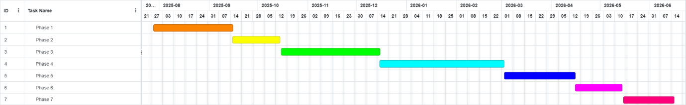

## Basic Functionalities

**Basic Functionality**

| User Type           | Features |
|--------------------|---------|
| Unregistered Users  | - Register and log in to the platform. - View notes if they have access to the link and the notes are not set as private.|
| Registered Users    | - Access a personal profile page. - Access to their personal list of notes. - View notes, whether their own or another user's. - Leave comments on notes they have access to. - Communicate with other authorized users through a comment section associated with each note. |
| Administrators      | - Full access to all user profiles and uploaded notes. - Ability to delete notes and comments. - Ability to ban a user from accessing the platform. |

**Intermediate Functionality**

**Registered Users**

| User Type           | Features |
|--------------------|---------|
| Registered Users    | - Use an interactive calendar to create events spanning one or multiple days. - Manage daily tasks in the form of a to-do list. - View the calendar in both monthly and daily formats, with a modal window appearing upon selecting a specific day in the monthly view. - Report inappropriate comments made by other users. |
| Administrators      | - Review user-reported comments in a ticket-based format. |

**Advanced Functionality**

| User Type           | Features |
|--------------------|---------|
| Registered Users    | - Upload notes to the platform, which will be processed using artificial intelligence to generate an overview, a summary, and multiple-choice questions in JSON format. - Access interactive quizzes derived from the JSON output for effective study sessions. - View a heatmap in their profile displaying the number of daily tasks assigned during the current month. - View a line chart showing performance progression upon completing a quiz. |

## **Screens**

### **Landing & Authentication**
**Landing** 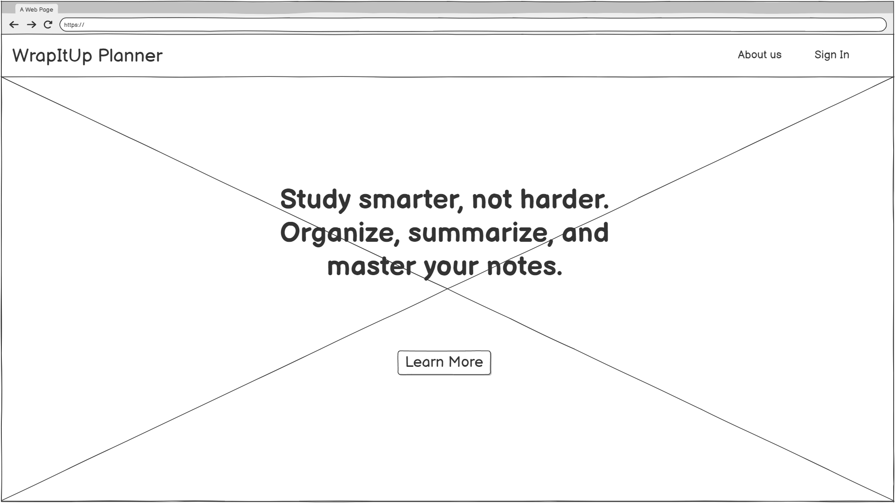  
  Landing page with the application's slogan and a background photo.  
  
**About Us** 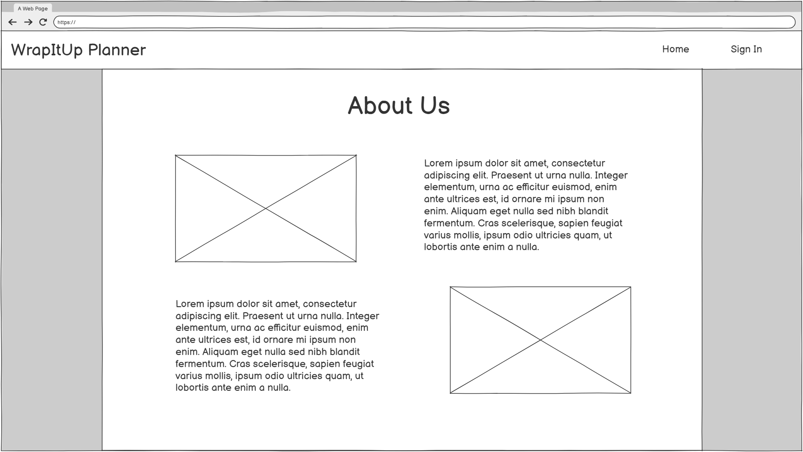  
  This page offers further information about the application's functionalities and uses.
  
**Login** 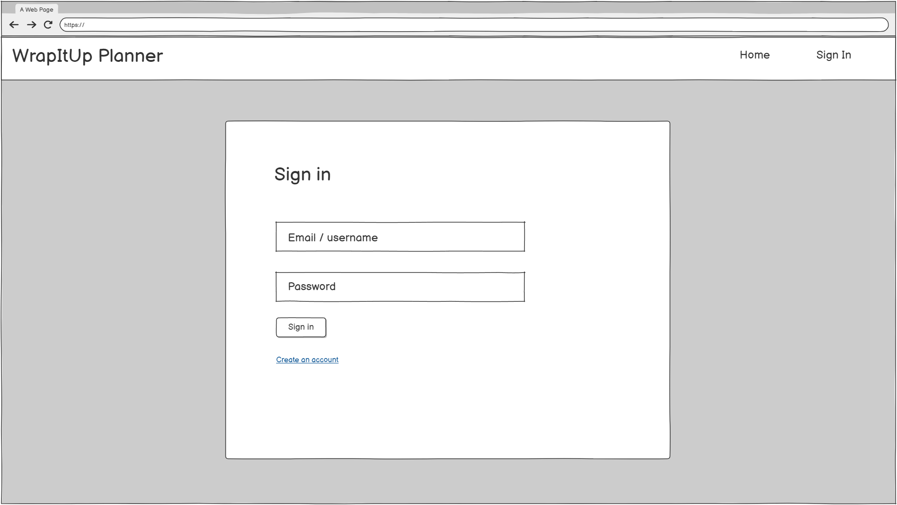  
  Allows existing users to sign in securely.
  
**Register** 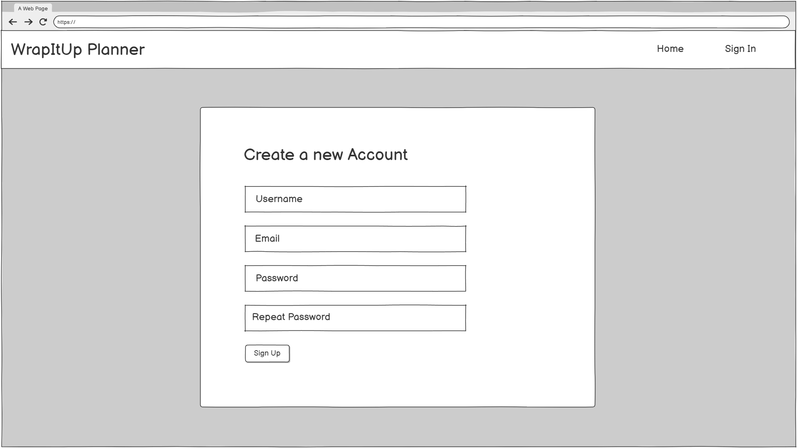  
  Page for new users to create an account.  

---

### **User Dashboard & Notes**
**User Dashboard** 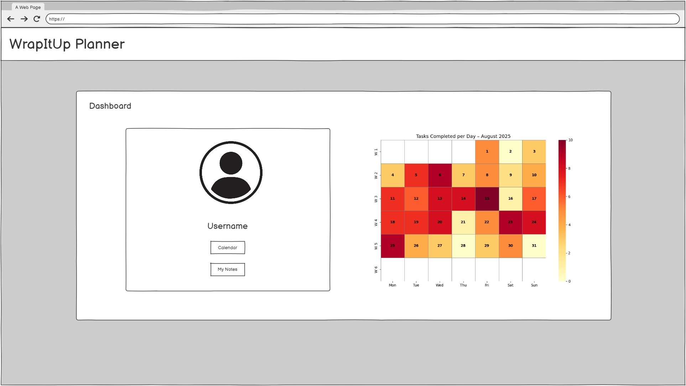  
  Main page for users showing key information and navigation to features.  
  
**My Notes** 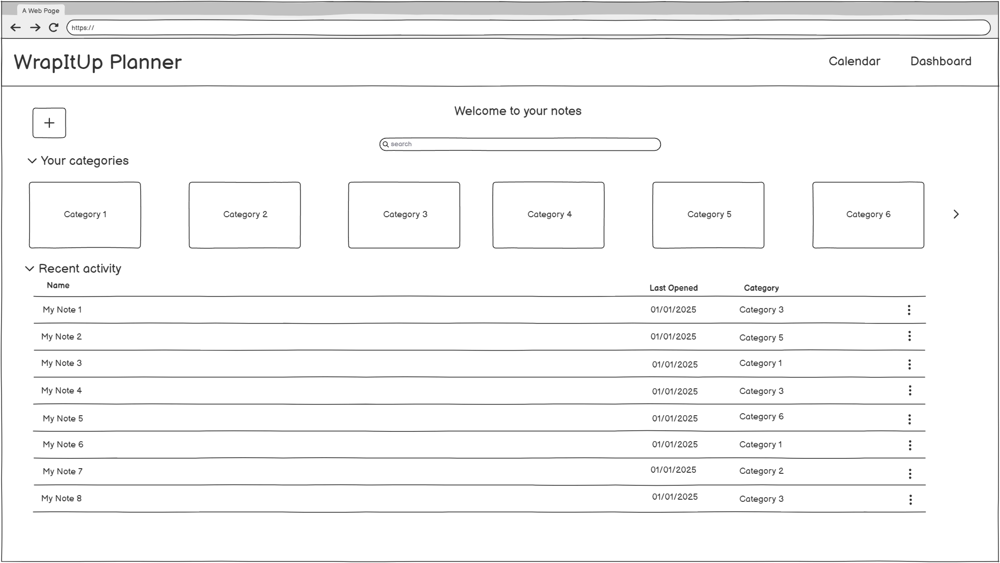  
  Displays all notes created by the user.  
  
**New Note** 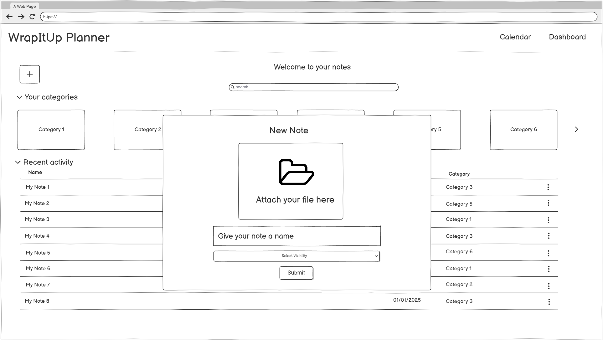  
  Interface to create a new note.  
  
**Generated Note** 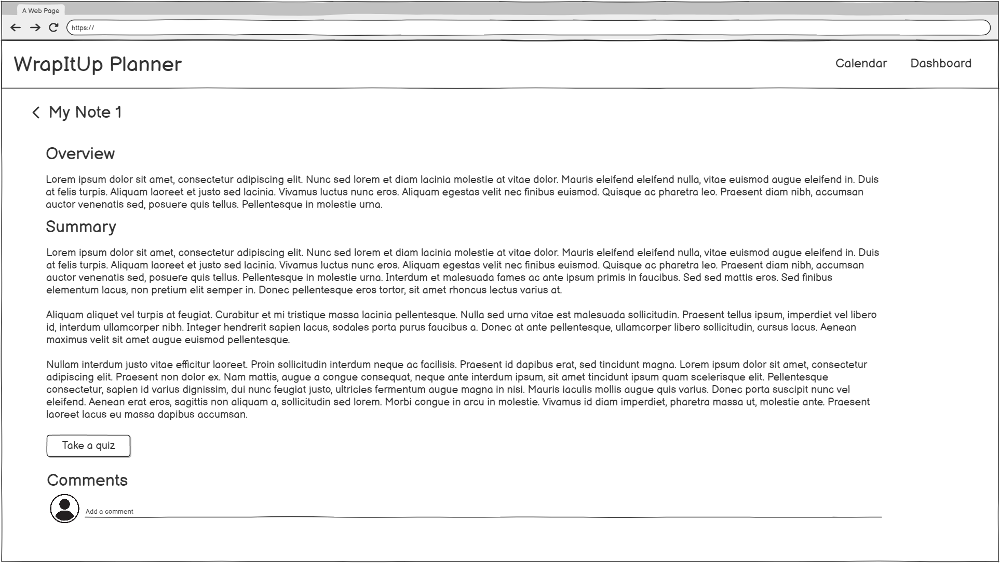  
  Automatically generated notes based on the user privided documents.  
  
**Generated Quiz** 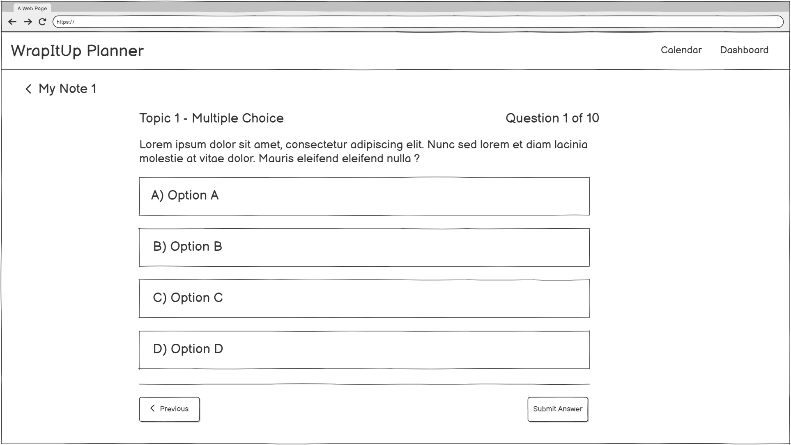  
  Quizzes generated from notes for study and practice.  

---

### **Admin Pages**
**Admin Dashboard**   
  Overview page for admins with access to the tickets page.  
  
**Admin Tickets** 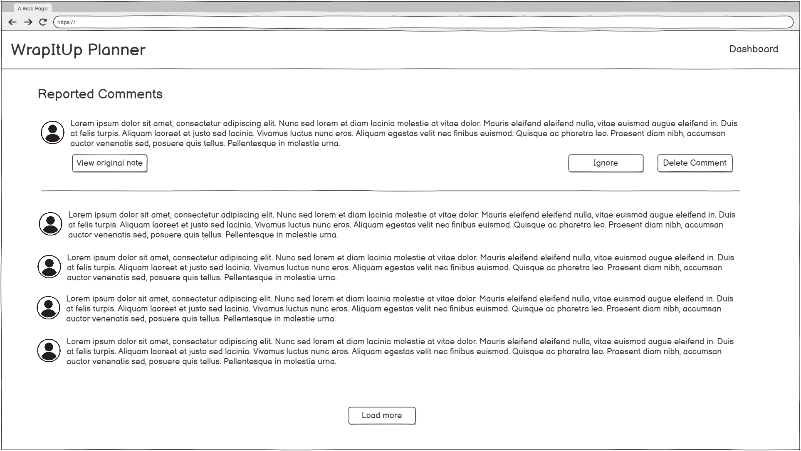  
  Interface to view and manage support tickets for reported comments.  

---

### **Calendar & Scheduling**
**Calendar** 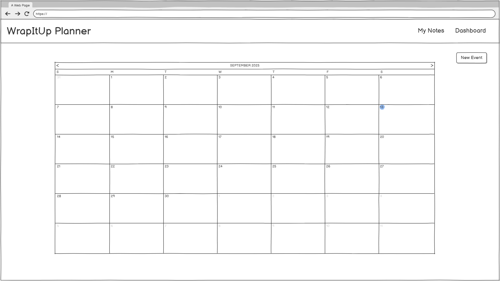  
  Monthly view of events.  
  
**Calendar Day** 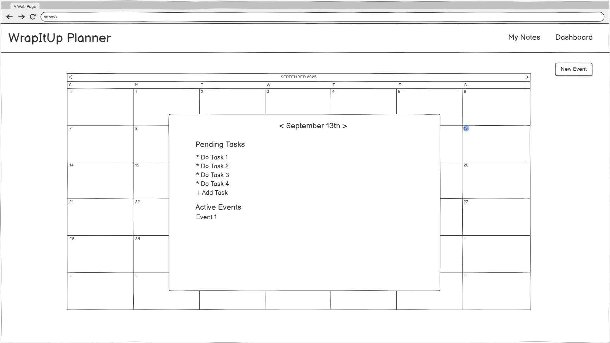  
  Detailed daily view of events and tasks.  
  
**Calendar New Event** 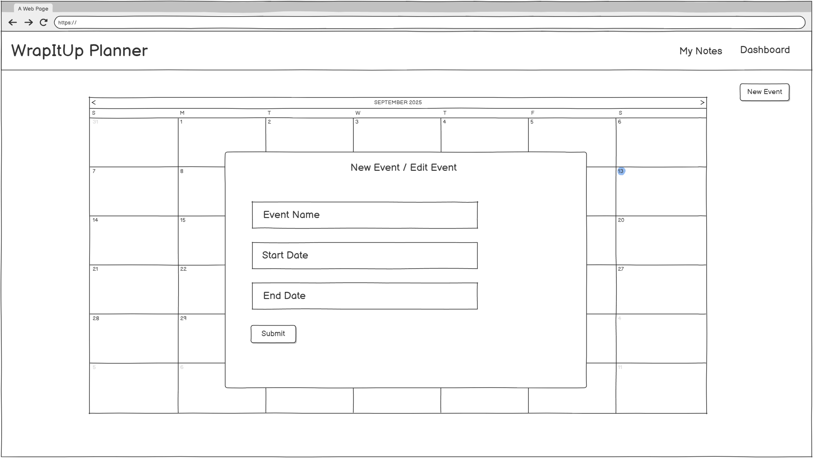  
  Interface to create and schedule new events.  

---

### Navigation Diagram

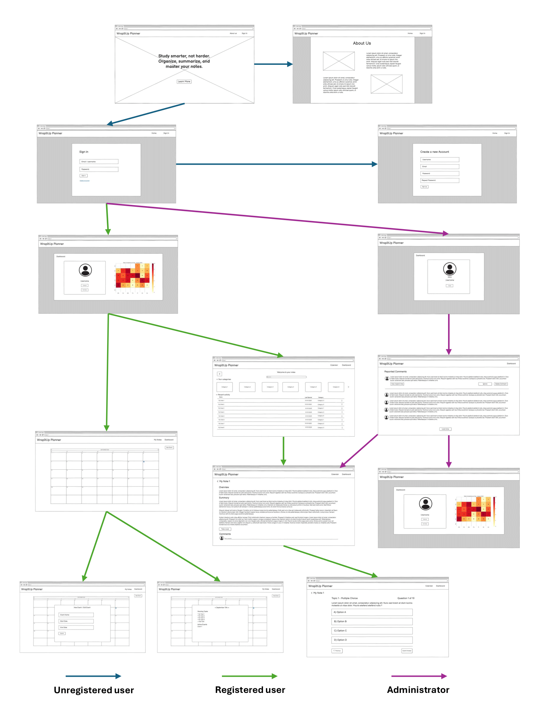  

## Entities and Relationships

**Entities**

| Entity         | Description                                                                                  |
|----------------|----------------------------------------------------------------------------------------------|
| **User**       | Stores login credentials, role, and account status.                                          |
| **AI_Notes**   | Represents the AI-generated content based on user-uploaded notes, including overview, summary, and quiz questions. Stores visibility settings. |
| **Comment**    | Represents a comment made by a user (or anonymously) on a specific set of notes.             |
| **CalendarEvent** | Represents an event created by a user in the interactive calendar, with start and end dates and a description. |
| **CalendarTask**  | Represents a to-do list task created by a user for a specific day.                        |
| **CommentReport** | Tracks reports submitted by users regarding inappropriate or problematic comments, including timestamp and status. |
| **QuizResult**    | Stores the outcome of a user's attempt at a quiz generated from a set of notes, including score percentage. |

**Relationships**

A user can upload multiple AI_Notes.

A user can create multiple comments, calendar events, calendar tasks,
quiz results, and comment reports.

AI_Notes can have multiple comments and multiple quiz results.

Comment can have multiple comment reports.

CommentReport is linked to one comment and one user (the reporter).

## Images

Registered users and administrators will be allowed to have their own profile picture

## Graphs

-   Line chart: Registered users will be allowed to see a line chart based on their performance in the AI generated quizzes.

-   Heatmap: Registered users may access a heatmap in their profile page based on the number of tasks each day during the current month.

## Complementary Technology

-   Ngx-charts as a framework for all data visualization in the project.

-   Google's Gemini Developer API for all the AI driven functionalities.

## Advanced Query

Registered users will be given the option to sort their generated summaries based on their average results in each of the quizzes.

## Progress Tracking

The progress of the project will be documented through a blog in Medium with development announcements, complemented by the use of GitHub Projects for task management and project organization.

[Link to the blog](https://medium.com/@gutierrezarturox)

\[Link to the Github Projects page\]

## Author

This application is developed within the framework of the Final Degree Project (TFG) of the degree in Software Engineering at the School of Computer Engineering (ETSII) of Universidad Rey Juan Carlos (URJC). The project is carried out by Arturo Enrique Gutierrez Mirandona under the supervision of Micael Gallego.
