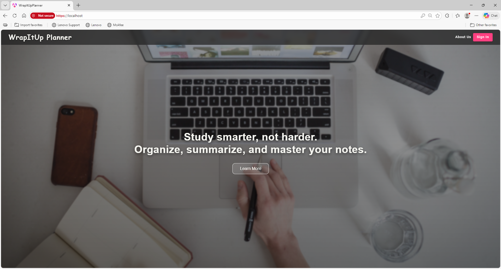
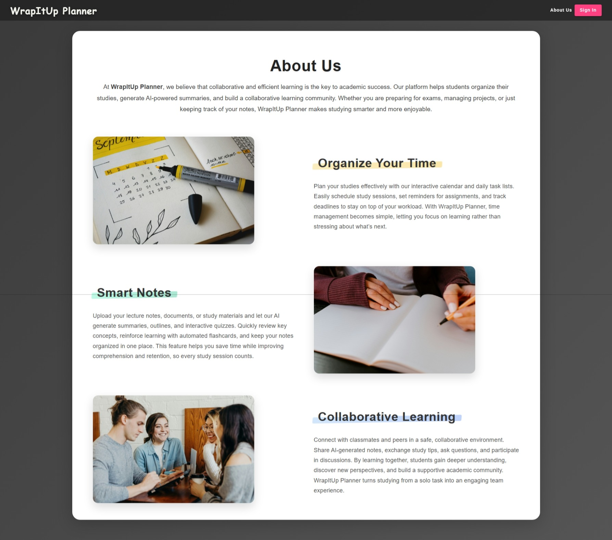
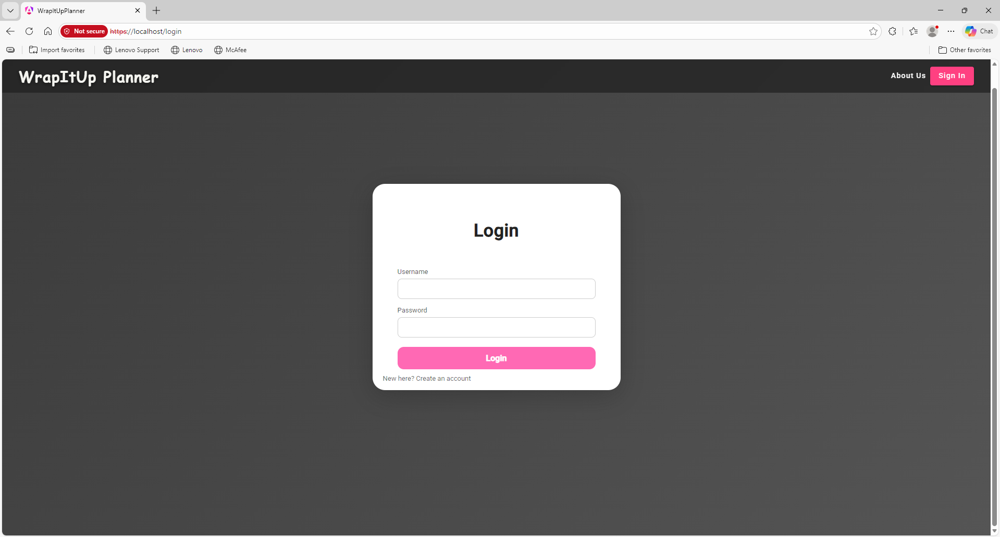
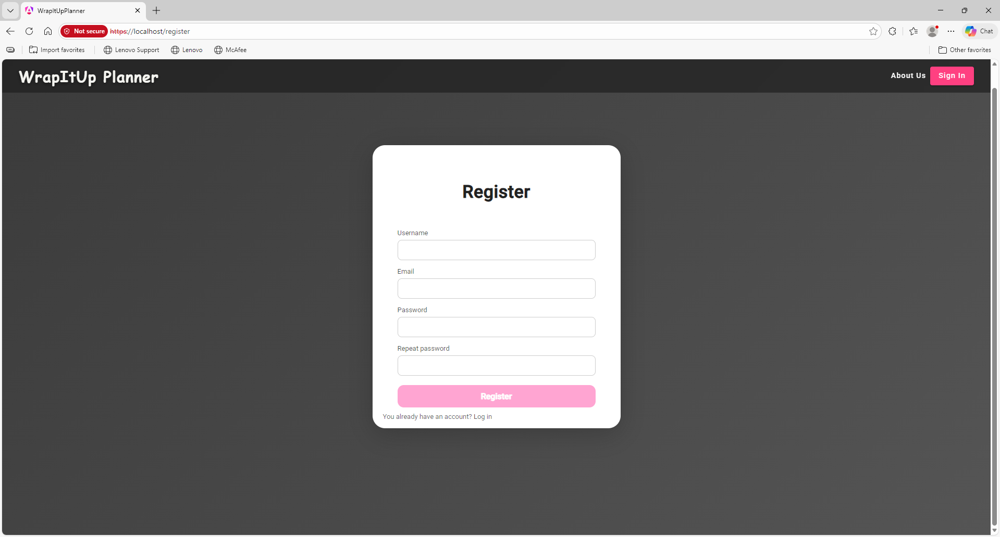
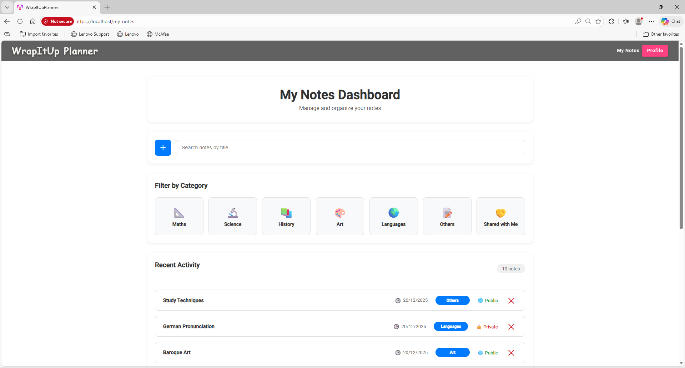
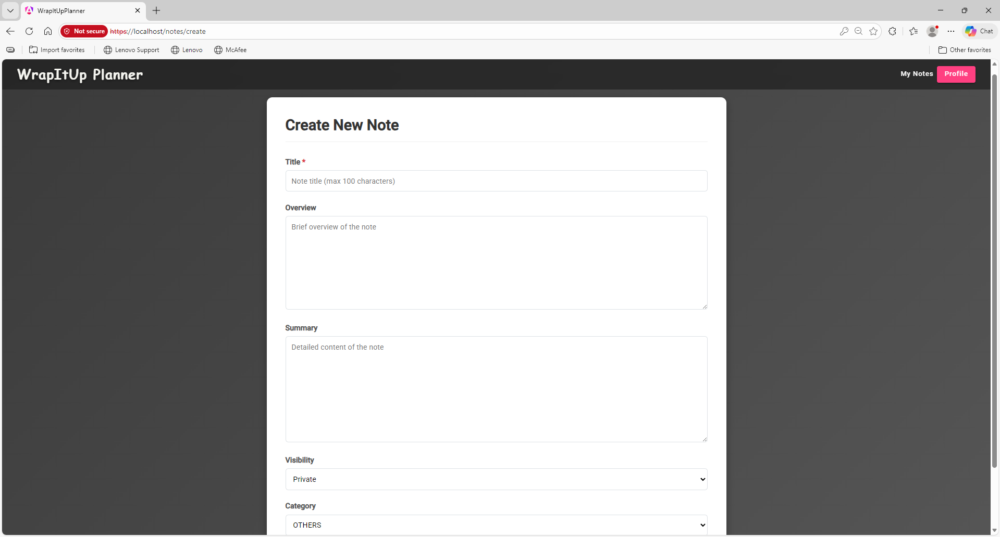
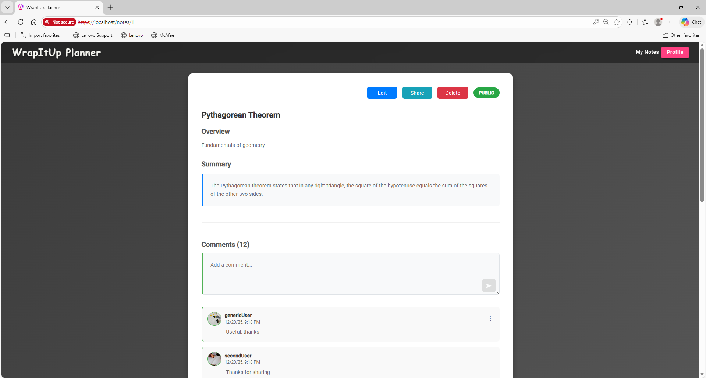
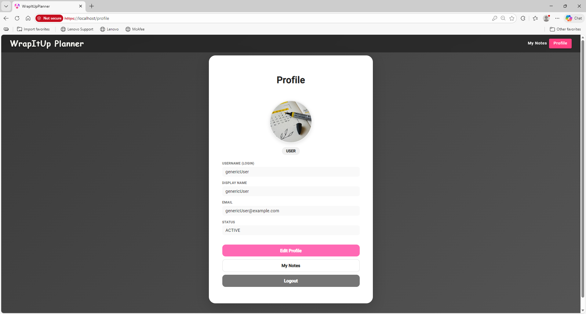
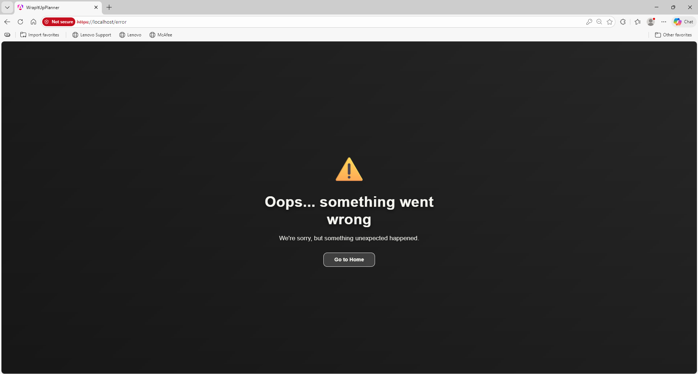

# WrapItUp Planner

WrapItUp Planner is an All-In-One collaborative web platform designed to help students manage their academic journey more efficiently. The application combines study organization, knowledge sharing, and AI-powered tools into a single platform. Students can create and share notes, collaborate through comments, and organize their academic life effectively.

## Version 0.1

Version 0.1 of WrapItUp Planner focuses on the note-taking and summary aspects of the application. Users can now create their own accounts, log in, and edit their profiles. The platform enables users to create, edit, delete, and view notes, which can be set as either public or private. Private note owners can share their content with specific users, allowing them to view and comment. Administrator functionality includes access to all notes and the ability to delete notes and comments when necessary. Users have a dedicated notes page where they can browse their content organized by categories and view notes that have been shared with them.

### Screenshots

*Landing page with application introduction*

*About Us page with platform information*

*Login page for existing users*

*Registration page for new users*

*User dashboard showing recent notes*

*Personal notes organized by category*

*Create new note interface*

*Note details page with comments section*

*User profile page*

*Error page for handling navigation errors*

### Demo Video

[Watch Version 0.1 Demo](link-to-video)

**Features demonstrated by user type:**
- **Unregistered Users**: View public notes, and landing page
- **Registered Users**: Create accounts, manage notes, share content, leave comments, visit and edit their profile
- **Administrators**: Moderate content, delete notes and comments

### Current Development Status

The application is currently in development and will be continuously improved as further versions are released.

## Future Versions

The next release of WrapItUp Planner will focus on the calendar component of the application, enabling users to organize their tasks, create events, and maintain daily to-do lists to structure their day-to-day activities. The final release will add AI-powered functionalities to further enhance the notes component, including automatic generation of overviews, summaries, and interactive quizzes from uploaded study materials.

## Documentation

- [Project Beginning](docs/readme/Project-Beginning.md) – Complete project overview with objectives, methodology, and planned features
- [Introduction](docs/readme/Introduction.md) – Overview of the development guide
- [Technologies](docs/readme/Technologies.md) – Languages, libraries, and services used
- [Tools](docs/readme/Tools.md) – IDEs and auxiliary development tools
- [Architecture](docs/readme/Architecture.md) – System architecture and components
- [Quality Control](docs/readme/Quality-control.md) – Testing and code analysis
- [Development Process](docs/readme/Development-process.md) – Git workflow and CI/CD
- [Code Execution and Editing](docs/readme/Code-Execution-And-Editing.md) – Setup and run instructions

## Project Information

This application is developed as part of the Final Degree Project (TFG) for the Software Engineering degree at the School of Computer Engineering (ETSII) of Universidad Rey Juan Carlos (URJC). The project is carried out by Arturo Enrique Gutierrez Mirandona under the supervision of Micael Gallego.

### Progress Tracking

Project progress is documented through a [Medium blog](https://medium.com/@gutierrezarturox) with development announcements and GitHub Projects for task management.

---

*For detailed information about the complete project scope, planned features, methodology, and all future functionalities, see the [Project Beginning](docs/readme/Project-Beginning.md) documentation.*
