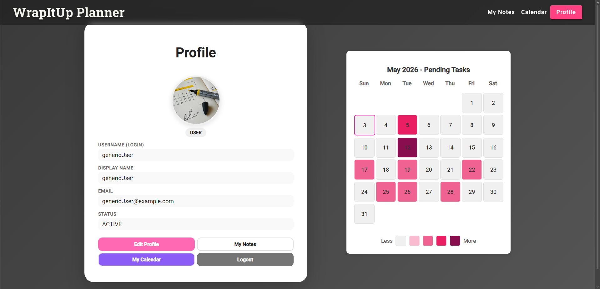
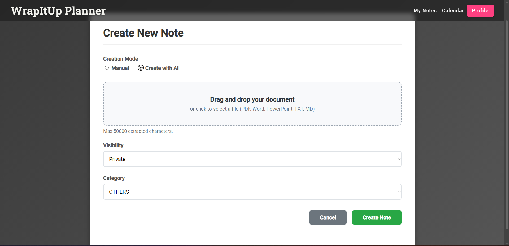
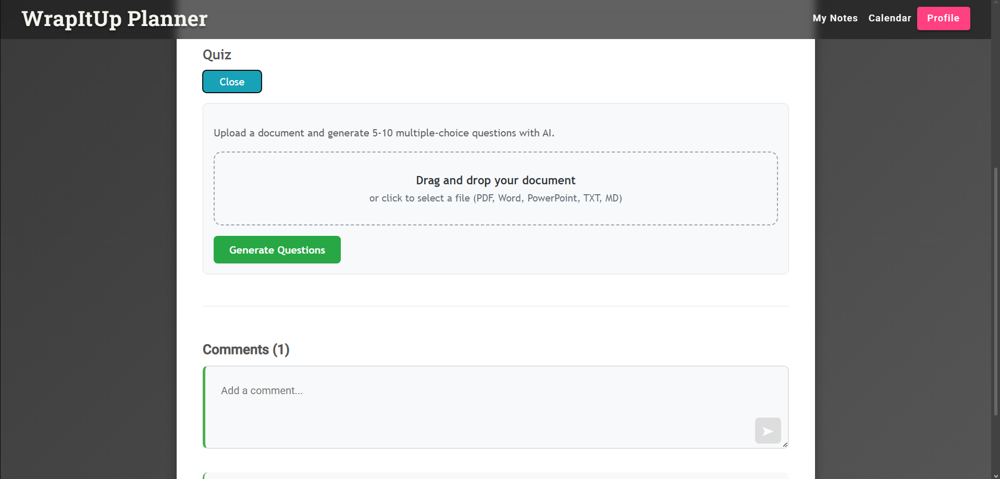
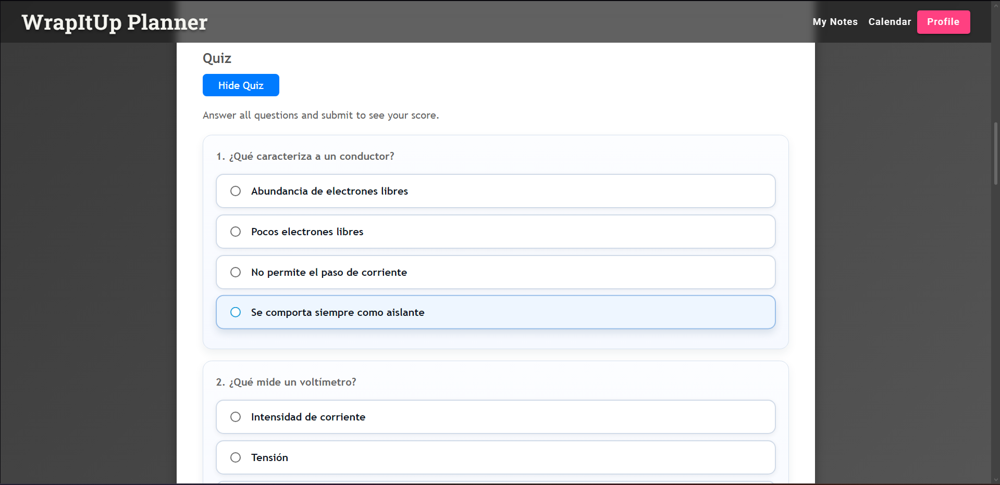
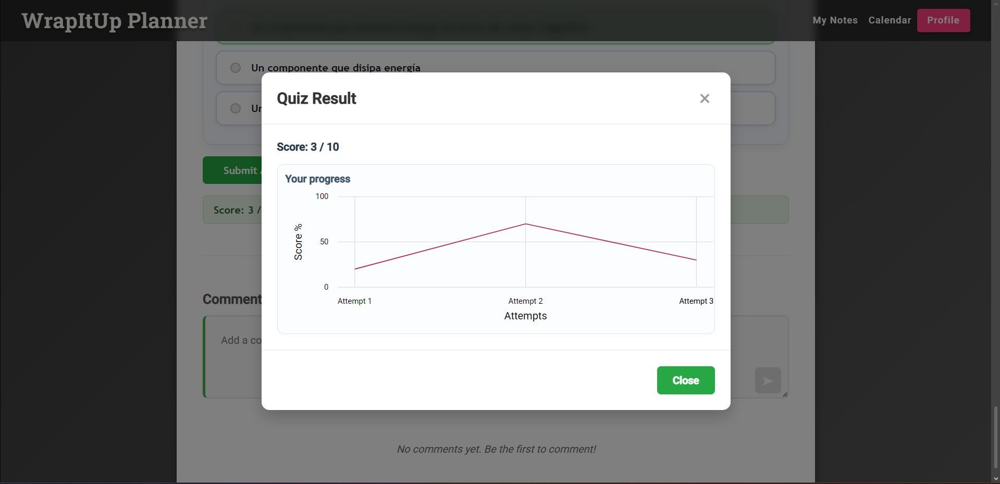

# WrapItUp Planner

WrapItUp Planner is an All-In-One collaborative web platform designed to help students manage their academic journey more efficiently. The application combines study organization, knowledge sharing, and AI-powered tools into a single platform. Students can create and share notes, collaborate through comments, and organize their academic life effectively.

## Version 1.0

Version 1.0 of WrapItUp Planner marks the successful completion of the application, with all planned features fully implemented. Building upon earlier iterations, this final version delivers a complete user experience across both productivity and moderation functionalities.

The latest additions focus on intelligent content processing for registered users. Users can upload their notes directly to the platform, where they are automatically analyzed using artificial intelligence. The system generates a structured overview, a concise summary, and multiple-choice questions formatted in JSON, transforming raw notes into interactive study material. For manually written notes, users can generate the multiple choice question by providing the original source material.

These generated resources are integrated into the learning experience. Users can engage with interactive quizzes based on the AI-generated questions, enabling more effective and dynamic study sessions. To further support learning, the application tracks quiz performance and presents results through a line chart, allowing users to monitor their progress over time.

All expected functionality has now been completed, and the application is considered fully developed and ready for use.

### Latest Developed Features - Screenshots

[](images/v.1.0/profile.png)
*Updated profile visual presentation*

[](images/v.1.0/createNoteAI.png)
*Upload notes and AI processing interface*

[](images/v.1.0/generateQuiz.png)
*Generate multiple-choice questions*

[](images/v.1.0/quiz.png)
*Interactive quiz interface for study sessions*

[](images/v.1.0/quizResults.png)
*Performance line chart and quiz results*

### Demo Videos

**Version 1.0:**
<br>
[](https://youtu.be/_cuC3-al830)

---

**Features demonstrated by user type:**
- **Registered Users**: Upload notes to the platform, which are processed using artificial intelligence to generate an overview, a summary, and multiple-choice questions in JSON format. They can access interactive quizzes based on this generated content and view a line chart in their profile that visualizes their performance progression after completing quizzes.

### Current Development Status

As of version 1.0, development is complete and the application is finalized.

### Latest Developed Features — Screenshots

**Key Screens:**

[](images/v.1.0/profile.png)
*Updated profile presentations*

[](images/v.1.0/createNoteAI.png)
*Note upload and AI processing*

[](images/v.1.0/generateQuiz.png)
*Automatic question generation and JSON export*

[](images/v.1.0/quiz.png)
*Interactive quiz UI*

[](images/v.1.0/quizResults.png)
*Quiz performance and results chart*

### Detailed Functionalities

**Basic Functionality -  IMPLEMENTED**

| User Type           | Features |
|--------------------|---------|
| Unregistered Users  | - Register and log in to the platform.<br>- View notes if they have access to the link and the notes are not set as private.|
| Registered Users    | - Access a personal profile page.<br>- Access to their personal list of notes.<br>- View notes, whether their own or another user's.<br>- Leave comments on notes they have access to.<br>- Communicate with other authorized users through a comment section associated with each note. |
| Administrators      | - Full access to all user profiles and uploaded notes.<br>- Ability to delete notes and comments. |

**Intermediate Functionality - IMPLEMENTED**

| User Type           | Features |
|--------------------|---------|
| Registered Users    | - Use an interactive calendar to create events spanning one or multiple days.<br>- Manage daily tasks in the form of a to-do list.<br>- View the calendar in both monthly and daily formats, with a modal window appearing upon selecting a specific day in the monthly view.<br>- Report inappropriate comments made by other users. <br> - View a heatmap in their profile displaying the number of daily tasks assigned during the current month.<br> |
| Administrators      | - Review user-reported comments in a ticket-based format. <br>- Ability to ban a user from accessing the platform. |

**Advanced Functionality - IMPLEMENTED**

| User Type           | Features |
|--------------------|---------|
| Registered Users    | - Upload notes to the platform, which will be processed using artificial intelligence to generate an overview, a summary, and multiple-choice questions in JSON format.<br>- Access interactive quizzes derived from the JSON output for effective study sessions.<br>- View a line chart showing performance progression upon completing a quiz. |

## How to Run the Application

### Prerequisites

Before running the application, ensure you have Docker installed on your system:

- **Windows and Mac**: Install [Docker Desktop](https://www.docker.com/products/docker-desktop/)
- **Linux**: Install [Docker Engine](https://docs.docker.com/engine/install/) and [Docker Compose](https://docs.docker.com/compose/install/)

### Running the Application

To run the application on your local machine, execute the following commands in your terminal:

```bash
docker pull arturox2500/wrapitup_planner:1.0
docker pull arturox2500/wrapitup_planner-compose:1.0
docker create --name temp-compose arturox2500/wrapitup_planner-compose:1.0 cmd.exe
docker cp temp-compose:/docker-compose.yml ./docker-compose.yml
docker rm temp-compose
docker compose up -d
```
#### Environment Setup
To run the application, create a `.env` file in the same directory as the `docker-compose.yml` and define the required environment variables there. The file should include entries for the MySQL credentials, Spring datasource settings, and server SSL configuration using this format:

```env
MYSQL_ROOT_PASSWORD=<value>
MYSQL_DATABASE=<value>
MYSQL_USER=<value>
MYSQL_PASSWORD=<value>

SPRING_DATASOURCE_URL=<value>
SPRING_DATASOURCE_USERNAME=<value>
SPRING_DATASOURCE_PASSWORD=<value>
SPRING_JPA_HIBERNATE_DDL_AUTO=<value>
SERVER_PORT=<value>
SERVER_SSL_KEY_STORE_PASSWORD=<value>

OPENAI_API_KEY=<value>
```

### Accessing the Application

Once the containers are running, you can access the application at:

**Web Application**: [https://localhost:443](https://localhost:443)

### Sample User Credentials

The application comes with pre-loaded sample data for testing purposes. You can log in with any of the following accounts:

| Username | Email | Password | Role |
|----------|-------|----------|------|
| genericUser | genericUser@example.com | 12345678 | User |
| secondUser | secondUser@example.com | 12345678 | User |
| thirdUser | thirdUser@example.com | 12345678 | User |
| admin | admin@example.com | 12345678 | Administrator |

### Sample Data Overview

The application is initialized with sample data to demonstrate its functionality:

**Users**:
- **genericUser**: Regular user with 13 notes across different categories, a profile picture, calendar events, and daily tasks
- **secondUser**: Regular user with 8 notes and a profile picture
- **thirdUser**: Regular user with 4 notes and a profile picture
- **admin**: Administrator account with full access to all notes and moderation capabilities.
**Notes**:
- 25 total notes covering various subjects (Mathematics, Science, History, Art, Languages, and Others)
- Notes are categorized by topic (e.g., "Pythagorean Theorem" under MATHS, "Photosynthesis" under SCIENCE)
- Mix of public and private notes
- Some notes are shared between users:
  - genericUser's "Pythagorean Theorem" is shared with secondUser
  - secondUser's "Quadratic Equations" is shared with genericUser
  - secondUser's "Impressionism" is shared with genericUser

**Comments**:
- 24 comments from genericUser, secondUser, and thirdUser showing interaction between users
- 5 reported comments flagged as inappropriate for admins to review

**Calendar Events** (genericUser):
- 7 events including study sessions, lectures, workshops, and deadlines
- Mix of single-day and multi-day events
- Both scheduled events and all-day events
- Color-coded by type (Blue, Yellow, Green, Red)

**Calendar Events** (secondUser):
- 2 events: a Chemistry Lab Prep session and a History Debate

**Calendar Events** (thirdUser):
- 4 events including a coding practice session, statistics revision, a workshop, and a model review meeting

**Calendar Tasks** (genericUser):
- 18 daily tasks spanning the current month
- Mix of academic tasks and personal tasks
- 7 completed tasks and 11 pending tasks
- Tasks visualized in the profile heat map

**Calendar Tasks** (secondUser):
- 3 tasks: Review Chemistry Notes, Prepare History Summary, and Language Review
- 2 completed, 1 pending

**Calendar Tasks** (thirdUser):
- 3 tasks: Build Practice App, Statistics Exercises, and Machine Learning Reading
- 1 completed, 2 pending

## Documentation

- [Project Beginning](docs/readme/Project-Beginning.md) – Complete project overview with objectives, methodology, and planned features
- [Introduction](docs/readme/Introduction.md) – Overview of the development guide
- [Technologies](docs/readme/Technologies.md) – Languages, libraries, and services used
- [Tools](docs/readme/Tools.md) – IDEs and auxiliary development tools
- [Architecture](docs/readme/Architecture.md) – System architecture and components
- [Quality Control](docs/readme/Quality-control.md) – Testing and code analysis
- [Development Process](docs/readme/Development-process.md) – Git workflow and CI/CD
- [Deployment](docs/readme/Deployment.md) – Packaging, distribution, and Docker deployment
- [Code Execution and Editing](docs/readme/Code-Execution-And-Editing.md) – Setup and run instructions

## Project Information

This application is developed as part of the Final Degree Project (TFG) for the Software Engineering degree at the School of Computer Engineering (ETSII) of Universidad Rey Juan Carlos (URJC). The project is carried out by Arturo Enrique Gutierrez Mirandona under the supervision of Micael Gallego.

### Progress Tracking

Project progress is documented through a [Medium blog](https://medium.com/@gutierrezarturox) with development announcements and GitHub Projects for task management.

---

*For detailed information about the complete project scope, planned features, methodology, and all future functionalities, see the [Project Beginning](docs/readme/Project-Beginning.md) documentation. This document represents the original vision.*
