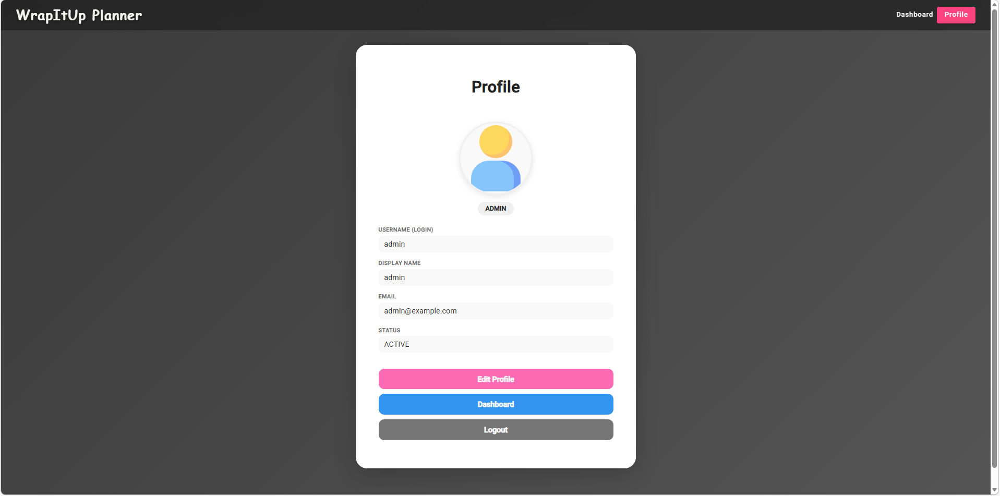
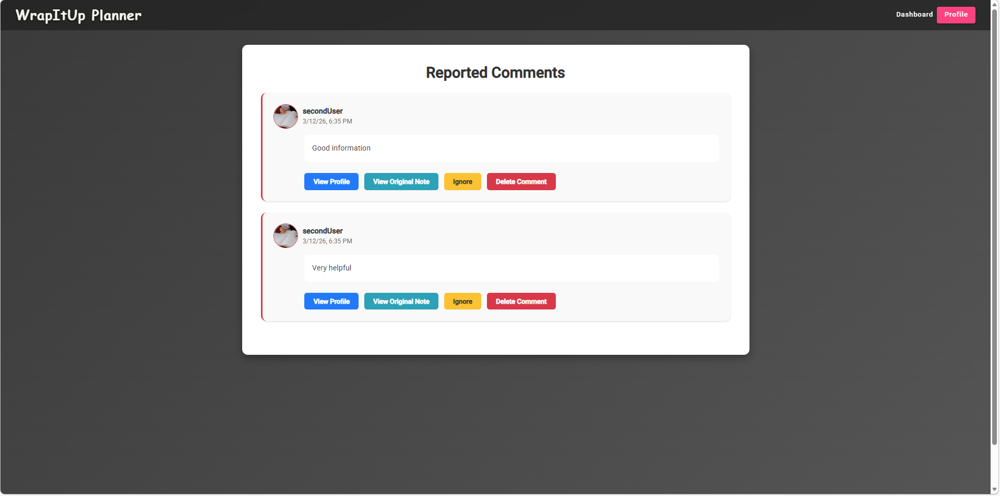
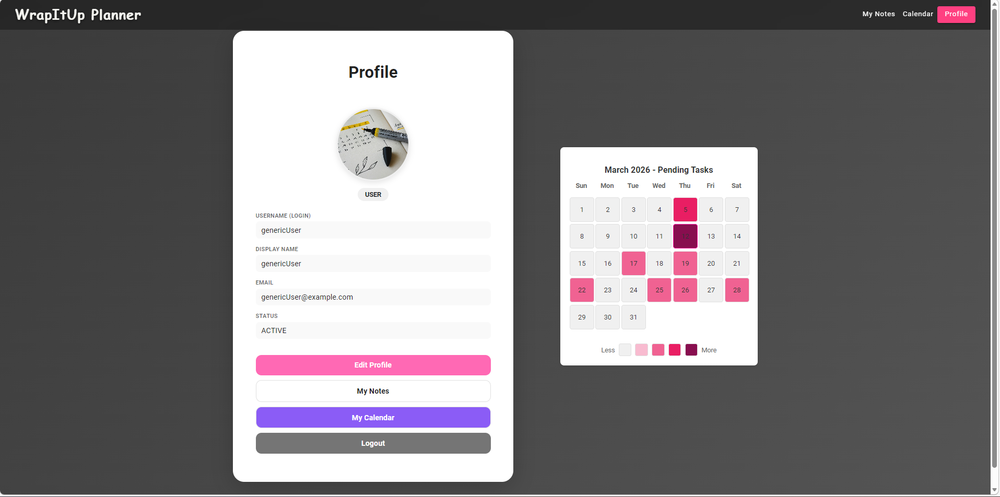
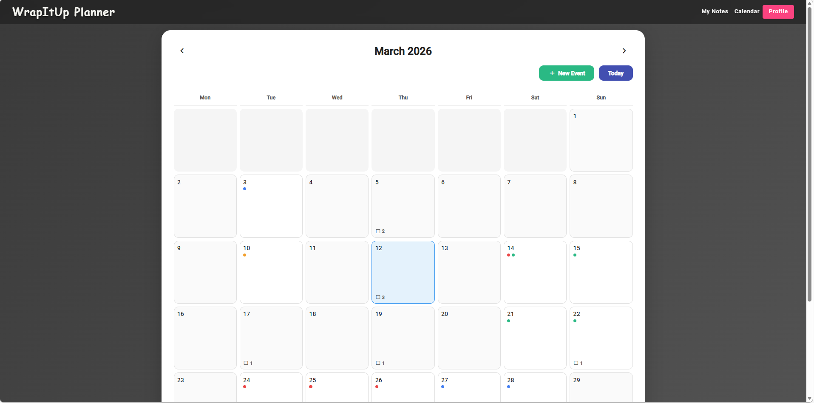
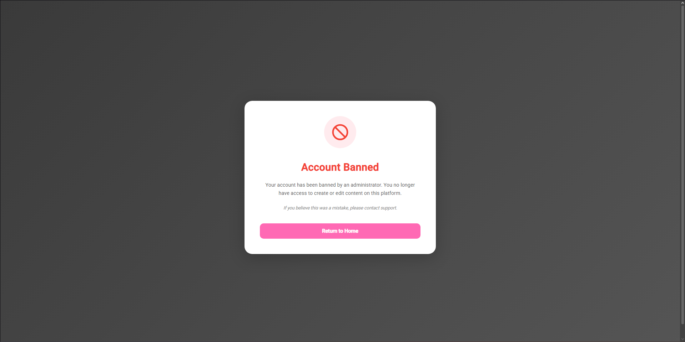
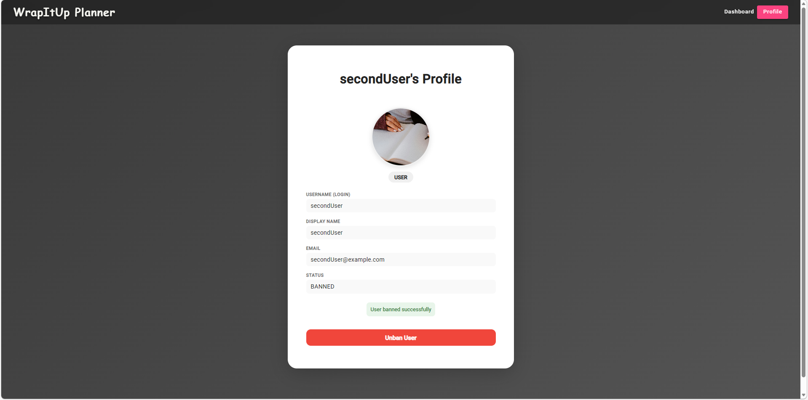
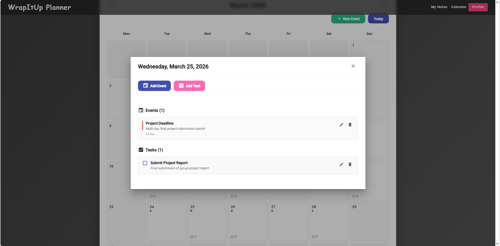
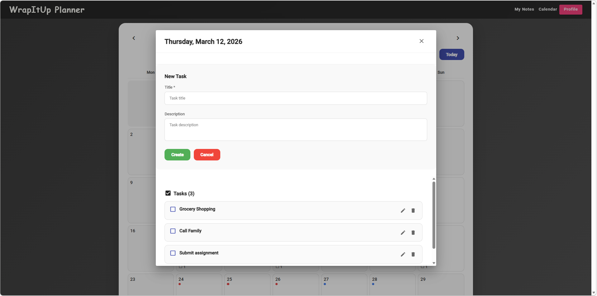
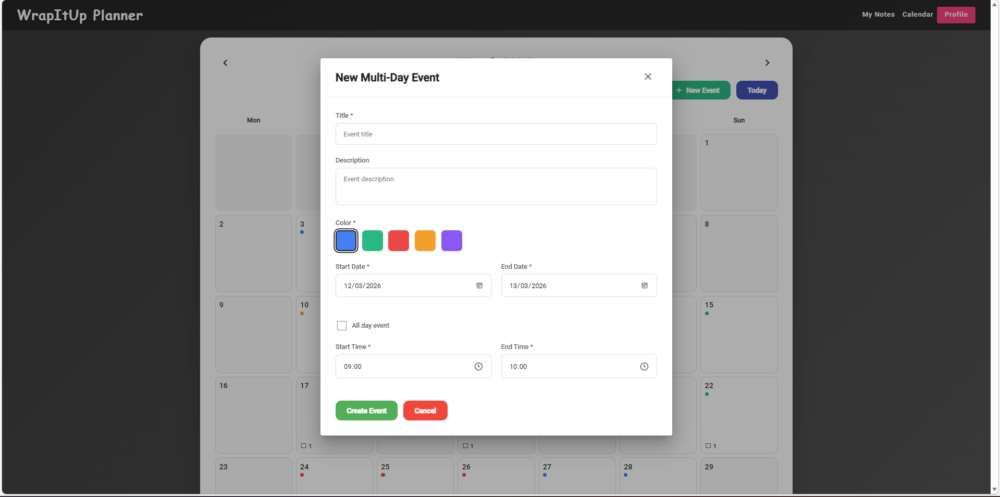

# WrapItUp Planner

WrapItUp Planner is an All-In-One collaborative web platform designed to help students manage their academic journey more efficiently. The application combines study organization, knowledge sharing, and AI-powered tools into a single platform. Students can create and share notes, collaborate through comments, and organize their academic life effectively.

## Version 0.2

Version 0.2 of WrapItUp Planner extends the functionality previously seen in version 0.1. This update introduces moderation tools for admins and also the application's calendar.

Admins now have access to their own dashboard, where they can review user reported comments, a new feature that allows users and admins to flag comments as inappropiate. From the dashboard admins can decide whether the content is correctly flagged or not. If necessary admins may ban users from accessing the platform.

In addition to updating the moderation side of the application, this version introduces the calendar feature, designed to help users organize their schedules. Using the calendar users can create daily tasks or multi-day events to better manage their time.

### Screenshots (new functionality)

[](images/v.0.2/adminProfile.png)
*Admin profile page with access to moderation dashboard*

[](images/v.0.2/adminDashboard.png)
*Admin dashboard showing reported comments with moderation actions*

[](images/v.0.2/Userprofile.png)
*User profile page with task heatmap visualization*

[](images/v.0.2/calendar.png)
*Calendar view with events and daily tasks*

[](images/v.0.2/bannedPage.png)
*Account banned notification page*

### Demo Video

Below is a demo video showcasing the application:

[](https://youtu.be/zgzQLEhDZpY)

---

**Features demonstrated by user type:**
- **Registered Users**: Report inappropriate comments, access the calendar, create, edit, and delete their own events and daily tasks, and view a **heat map** in their profile that visualizes their pending daily tasks.
- **Administrators**: Access all reported comments through the admin dashboard, unflag comments if they were incorrectly reported, and ban users from the platform when necessary.

### Current Development Status

The application is currently in development and will be continuously improved as further versions are released.

## Future Versions

The next release of WrapItUp Planner will focus on the AI component of the application, registered users will be able to upload notes to the platform, which will be processed using artificial intelligence to automatically generate an overview, a summary, and multiple-choice questions in JSON format. These outputs will allow users to access interactive quizzes derived from their uploaded materials.

### Functionalities (Version 0.2)

**Admin Features:**

[](images/v.0.2/adminProfile.png)
*Admin profile page with access to moderation dashboard*

[](images/v.0.2/adminDashboard.png)
*Admin dashboard showing reported comments with moderation actions (ignore, delete, view profile, view original note)*

[](images/v.0.2/bannedUser.png)
*Admin view of a banned user profile with unban option*

**Moderation:**

[](images/v.0.2/bannedPage.png)
*Account banned notification page displayed when a banned user attempts to access the platform*

**Calendar Features:**

[](images/v.0.2/Userprofile.png)
*User profile page with task heatmap visualization showing pending tasks for the current month*

[](images/v.0.2/calendar.png)
*Calendar monthly view with events (colored dots) and daily tasks (checkbox indicators)*

[](images/v.0.2/daily-view.png)
*Calendar daily view showing events and tasks for a specific day with add/edit/delete options*

[](images/v.0.2/createTask.png)
*Create new daily task dialog with title and description fields*

[](images/v.0.2/Multi-day-event.png)
*Create multi-day event dialog with color selection, date range, and time configuration*

### Detailed Functionalities

**Basic Functionality -  IMPLEMENTED**

| User Type           | Features |
|--------------------|---------|
| Unregistered Users  | - Register and log in to the platform.<br>- View notes if they have access to the link and the notes are not set as private.|
| Registered Users    | - Access a personal profile page.<br>- Access to their personal list of notes.<br>- View notes, whether their own or another user's.<br>- Leave comments on notes they have access to.<br>- Communicate with other authorized users through a comment section associated with each note. |
| Administrators      | - Full access to all user profiles and uploaded notes.<br>- Ability to delete notes and comments. |

**Intermediate Functionality - IMPLEMENTED**

| User Type           | Features |
|--------------------|---------|
| Registered Users    | - Use an interactive calendar to create events spanning one or multiple days.<br>- Manage daily tasks in the form of a to-do list.<br>- View the calendar in both monthly and daily formats, with a modal window appearing upon selecting a specific day in the monthly view.<br>- Report inappropriate comments made by other users. <br> - View a heatmap in their profile displaying the number of daily tasks assigned during the current month.<br> |
| Administrators      | - Review user-reported comments in a ticket-based format. <br>- Ability to ban a user from accessing the platform. |

### Planned Features

**Advanced Functionality - NEXT RELEASE (Version 1.0)**

| User Type           | Features |
|--------------------|---------|
| Registered Users    | - Upload notes to the platform, which will be processed using artificial intelligence to generate an overview, a summary, and multiple-choice questions in JSON format.<br>- Access interactive quizzes derived from the JSON output for effective study sessions.<br>- View a line chart showing performance progression upon completing a quiz. |

## How to Run the Application

### Prerequisites

Before running the application, ensure you have Docker installed on your system:

- **Windows and Mac**: Install [Docker Desktop](https://www.docker.com/products/docker-desktop/)
- **Linux**: Install [Docker Engine](https://docs.docker.com/engine/install/) and [Docker Compose](https://docs.docker.com/compose/install/)

### Running the Application

To run the application on your local machine, execute the following commands in your terminal:

```bash
docker pull arturox2500/wrapitup_planner:0.1
docker pull arturox2500/wrapitup_planner-compose:0.1
docker create --name temp-compose arturox2500/wrapitup_planner-compose:0.1 cmd.exe
docker cp temp-compose:/docker-compose.yml ./docker-compose.yml
docker cp temp-compose:/.env ./.env
docker rm temp-compose
docker compose up -d
```

### Accessing the Application

Once the containers are running, you can access the application at:

**Web Application**: [https://localhost:443](https://localhost:443)

### Sample User Credentials

The application comes with pre-loaded sample data for testing purposes. You can log in with any of the following accounts:

| Username | Email | Password | Role |
|----------|-------|----------|------|
| genericUser | genericUser@example.com | 12345678 | User |
| secondUser | secondUser@example.com | 12345678 | User |
| admin | admin@example.com | 12345678 | Administrator |

### Sample Data Overview

The application is initialized with sample data to demonstrate its functionality:

**Users**:
- **genericUser**: Regular user with 12 notes across different categories, a profile picture, calendar events, and daily tasks
- **secondUser**: Regular user with 6 notes and a profile picture
- **admin**: Administrator account with full access to all notes and moderation capabilities, they have to access notes through an url in this phase

**Notes**:
- 18 total notes covering various subjects (Mathematics, Science, History, Art, Languages, and Others)
- Notes are categorized by topic (e.g., "Pythagorean Theorem" under MATHS, "Photosynthesis" under SCIENCE)
- Mix of public and private notes
- Some notes are shared between users (e.g., genericUser's "Pythagorean Theorem" is shared with secondUser)

**Comments**:
- 12 comments from both genericUser and secondUser showing interaction between users
- 2 reported comments flagged as inappropriate for admins to review

**Calendar Events** (genericUser):
- 7 events including study sessions, lectures, workshops, and deadlines
- Mix of single-day and multi-day events
- Both scheduled events and all-day events
- Color-coded by type (Blue, Yellow, Green, Red)

**Calendar Tasks** (genericUser):
- 18 daily tasks spanning the current month
- Mix of academic tasks and personal tasks
- 6 completed tasks and 12 pending tasks
- Tasks visualized in the profile heat map


## Documentation

- [Project Beginning](docs/readme/Project-Beginning.md) – Complete project overview with objectives, methodology, and planned features
- [Introduction](docs/readme/Introduction.md) – Overview of the development guide
- [Technologies](docs/readme/Technologies.md) – Languages, libraries, and services used
- [Tools](docs/readme/Tools.md) – IDEs and auxiliary development tools
- [Architecture](docs/readme/Architecture.md) – System architecture and components
- [Quality Control](docs/readme/Quality-control.md) – Testing and code analysis
- [Development Process](docs/readme/Development-process.md) – Git workflow and CI/CD
- [Deployment](docs/readme/Deployment.md) – Packaging, distribution, and Docker deployment
- [Code Execution and Editing](docs/readme/Code-Execution-And-Editing.md) – Setup and run instructions

## Project Information

This application is developed as part of the Final Degree Project (TFG) for the Software Engineering degree at the School of Computer Engineering (ETSII) of Universidad Rey Juan Carlos (URJC). The project is carried out by Arturo Enrique Gutierrez Mirandona under the supervision of Micael Gallego.

### Progress Tracking

Project progress is documented through a [Medium blog](https://medium.com/@gutierrezarturox) with development announcements and GitHub Projects for task management.

---

*For detailed information about the complete project scope, planned features, methodology, and all future functionalities, see the [Project Beginning](docs/readme/Project-Beginning.md) documentation.*
