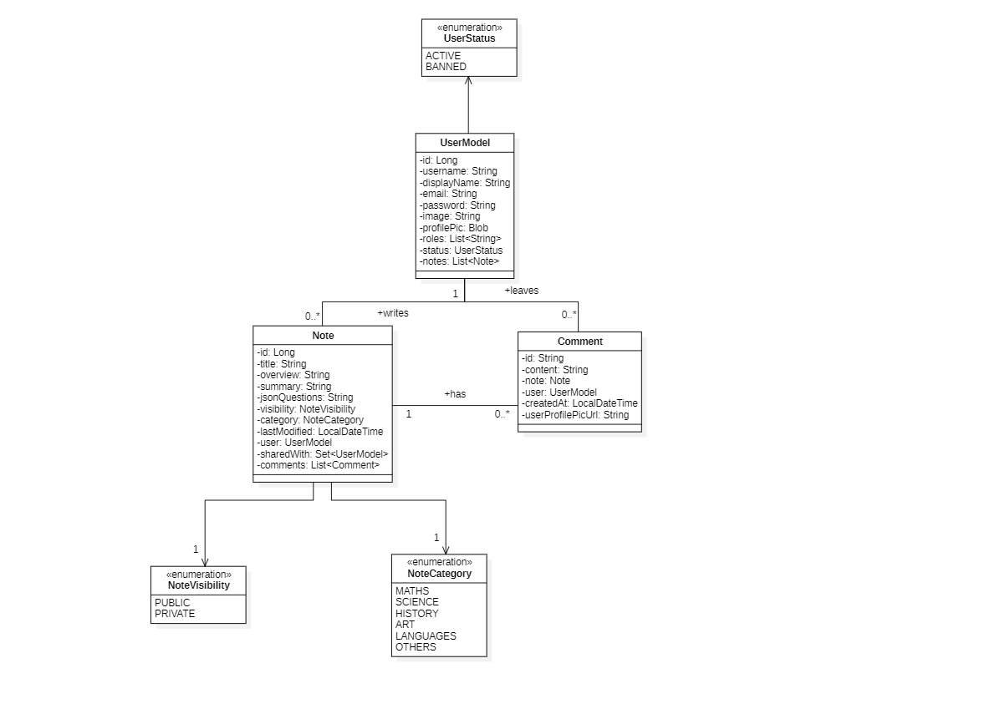
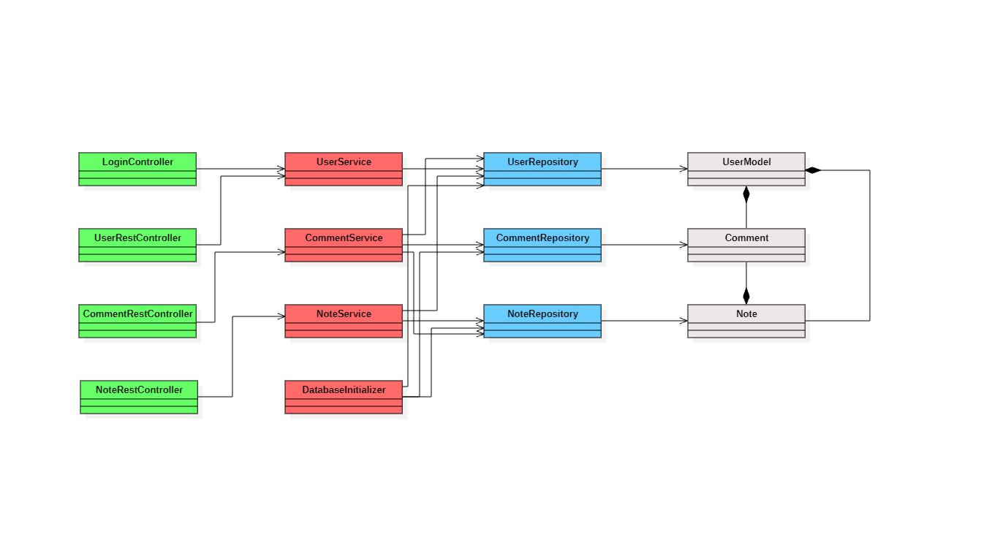
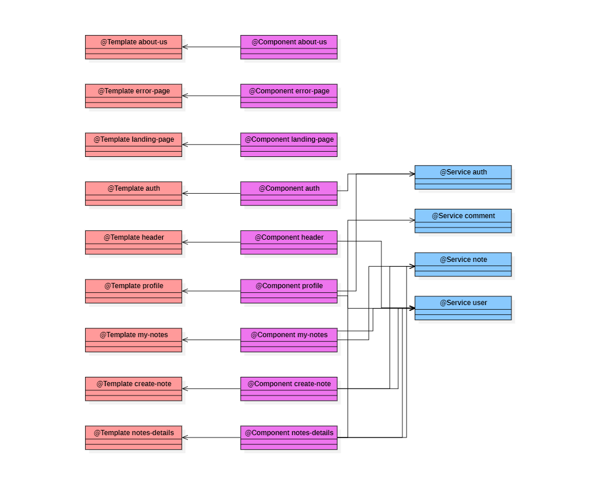

# Architecture

### Deployment Architecture

The application is structured following a **deployment architecture** where the frontend and backend run as independent processes:

- **Angular Frontend:** Runs via the Angular development server and communicates with the backend through **HTTP/REST** requests.  
- **Spring Boot Backend:** Exposes the REST API, handles business logic, and manages database access.  

All components communicate using standard **HTTP/HTTPS protocols**, and the SQL database is connected to the backend via MySQL Connector. This architecture ensures modularity and scalability between frontend, backend, and database layers.

## Domain Model

The domain model represents the core entities and their relationships within the application:

## REST API

The application's REST API is automatically documented using **OpenAPI**. The documentation can be accessed in HTML format through the following URL (served via [RawGitHack](https://raw.githack.com)):  
[OpenAPI HTML Documentation](https://raw.githack.com/codeurjc-students/2025-WrapItUp-Planner/main/docs/api/api-documentation.html)

## Server Architecture

The backend follows a layered architecture pattern organized into distinct layers:

## Client Architecture

The frontend is built using Angular and follows a component-based architecture:

