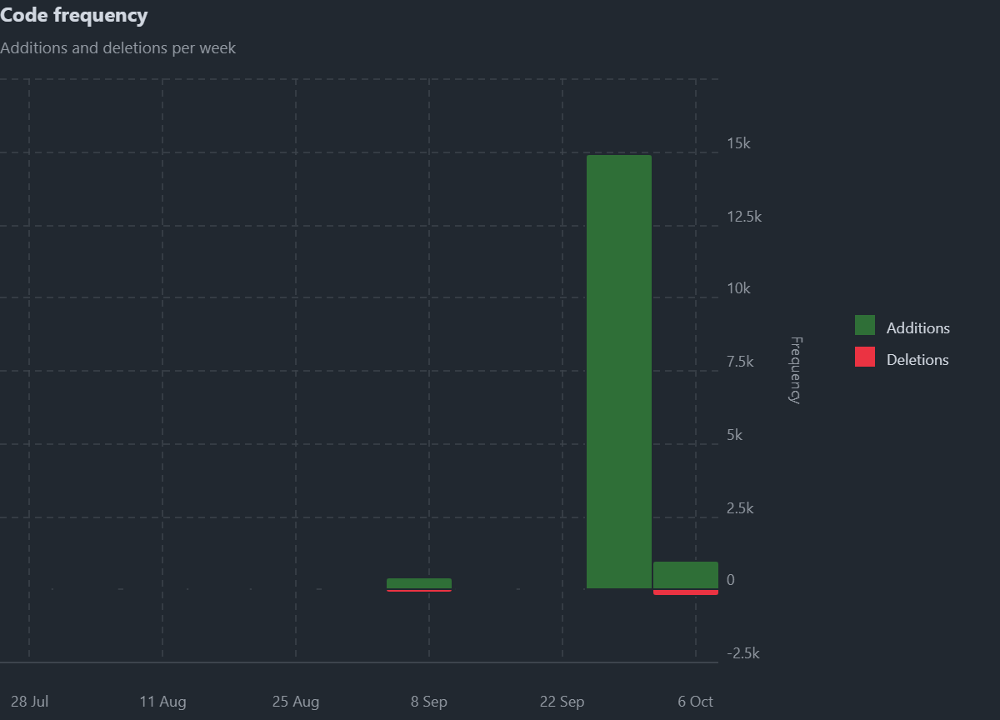

# Development Process

## 1. Methodology
- The project follows an **iterative and incremental approach**, aligned with Agile principles and incorporating selected practices from Extreme Programming (XP) and Kanban.  
- Development focuses on delivering minimum viable functionality in short cycles, allowing for continuous feedback, improvement, and incremental delivery of features.  
- Kanban boards are used to visualize work in progress, and guarantees smooth task transitions from backlog to completion.

## 2. Task Management
- Tasks are tracked using **GitHub Issues** and **GitHub Projects**, providing a clear overview of priorities and progress.  
- The visual board supports iterative planning and quick adjustments in response to changing requirements.

## 3. Version Control
- Git manages all source code, with a feature-branch workflow:
  - main branch contains stable, production-ready code.
  - Feature branches are created for each new functionality or bug fix.
  - Pull Requests are reviewed and pass automated quality gates before merging.  
- **Metrics tracked**:
  - **Commits:** 35 commits in total.
  - **Branches:** 2 branches (main and one fix branch).
  - **Pull Requests:** At least one PR created and merged.
- **Repository activity visualizations**:
  - **Commits over time:**  
    
  - **Code frequency (lines added/removed):**  
    

## 4. Continuous Integration (CI/CD)
- **GitHub Actions** automates testing, building, and code validation for every push to feature branches and pull request to the main branch.
- The CI workflows are structured in two levels:
  1. **Basic CI**: triggered on pushes to feature/fix branches, runs backend and frontend unit tests, and builds the projects.
  2. **Full CI**: triggered on pull requests to main, runs:
     - Backend unit, integration, and system tests
     - Frontend unit and E2E tests
     - Static code analysis with SonarCloud

