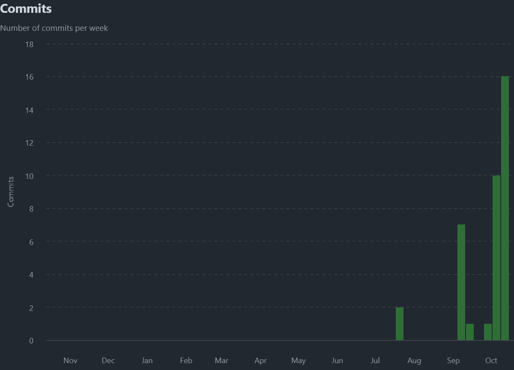

# Development Process

## 1. Methodology
- The project follows an **iterative and incremental approach**, aligned with Agile principles and incorporating selected practices from Extreme Programming (XP) and Kanban.  
- Development focuses on delivering minimum viable functionality in short cycles, allowing for continuous feedback, improvement, and incremental delivery of features.  
- Kanban boards are used to visualize work in progress, and guarantees smooth task transitions from backlog to completion.

## 2. Task Management
- Tasks are tracked using **GitHub Issues** and **GitHub Projects**, providing a clear overview of priorities and progress.  
- The visual board supports iterative planning and quick adjustments in response to changing requirements.

## 3. Version Control
- Git manages all source code, with a feature-branch workflow:
  - main branch contains stable, production-ready code.
  - Feature branches are created for each new functionality or bug fix.
  - Pull Requests are reviewed and pass automated quality gates before merging.  
- **Metrics tracked**:
  - **Commits:** 125 commits in total.
  - **Branches:** 20 branches.
  - **Pull Requests:** 29 PR created and merged.
- **Repository activity visualizations**:
  - **Commits over time:**  
    
  - **Code frequency (lines added/removed):**  
    

## 4. Continuous Integration (CI/CD)
- **GitHub Actions** automates testing, building, and code validation for every push to feature branches and pull request to the main branch.
### 4.1. CI Workflows
- **Basic CI** `ci-basic.yml` - Triggered on pushes to `feature/*` and `fix/*` branches. Runs backend and frontend unit tests and builds.
- **Full CI** `ci-full.yml` - Triggered on pull requests to `main`. Runs complete testing (unit, integration, system, and E2E tests), deploys services locally, and performs SonarCloud analysis.

- **Automated deployment**: `docker-main.yml` - builds and pushes Docker images to DockerHub on every push to `main`.
- **Release deployment**: `docker-release.yml` - triggered on GitHub releases, builds and pushes production images with version tags.
- **Manual workflow**: `docker-manual.yml` - on-demand Docker builds for testing.

## 5. Release Management

### 5.1. Release Process
- Releases are created through GitHub Releases when major features are completed and tested.
- Each release triggers the `docker-release.yml` workflow, which builds and publishes Docker images to DockerHub with version-specific tags.

### 5.2. Version 0.1 
**Release Date:** December 2024

**Features:**
- **User Management:**
  - User registration and authentication
  - Profile management with customizable information and profile pictures
  - Role-based functionalities (Users and Administrators)

- **Note Management:**
  - Create, edit, delete, and view notes
  - Public and private visibility settings
  - Category organization (Mathematics, Science, History, Art, Languages, Others)
  - Note sharing with other users

- **Collaboration:**
  - Comment system for shared notes
  - User interaction on shared content

- **Administration:**
  - Full access to all notes and user profiles
  - Delete notes and comments

