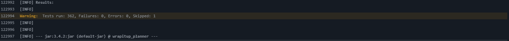
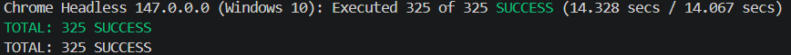
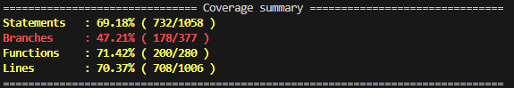
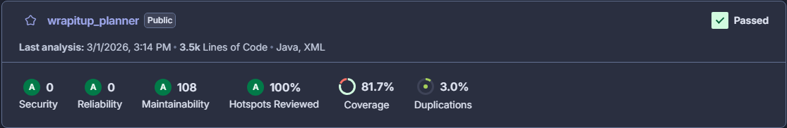
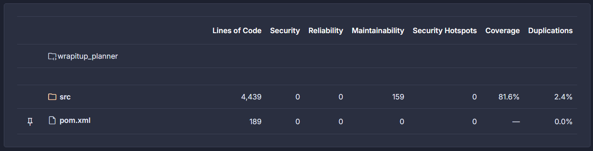

## Quality Control

To ensure the quality and reliability of WrapItUp Planner, different levels of testing were applied during the development of the application.  
The testing strategy covers both the **backend (server)** and the **frontend (client)** to guarantee the system works accordingly across all the different layers.

### 1. Server Tests

- **Unit Tests:**  
  Focused on verifying the functionality of backend services by themselves using database doubles (mocks). These tests ensure that individual components, such as service methods and certain data behave correctly under specific conditions.

- **Integration Tests:**  
  Performed by connecting the application to a real database to validate that repository interactions function as expected. These tests confirm that entities such as notes and users are correctly stored and retrieved from the database.

- **REST API Tests:**  
  Implemented using REST Assured, these tests validate that the REST API endpoints correctly retrieve and return example data from the system’s main entity. They ensure that the responses follow the expected structure, status codes, and content types.

### 2. Client Tests

- **Unit Tests:**  
  Designed to test individual Angular components using service doubles and a virtual DOM environment. These tests ensure that component logic and data rendering function properly in isolation.

- **Integration Tests:**  
  Connect the frontend with the real REST API to verify that data retrieved from the backend is correctly displayed on the user interface. They help ensure that communication between the client and server works as expected.

- **End-to-End (E2E) Tests:**  
  Conducted using **Karma**, **Jasmine**, and **Selenium**, these tests simulate real user interactions to validate the complete workflow of the application. They ensure that the user interface correctly displays data retrieved from the backend and that navigation, form submission, and content updates behave as expected under real browser conditions.

### Functional Coverage

The automated tests cover the complete functionality (Version 1.0) of WrapItUp Planner, making sure the application works according to what it was designed to accomplish:

#### Backend Tests - Version 0.1

**Unit Tests:**
- **Authentication Service**: User registration, login, password encoding, and token management
- **Note Service**: Note creation, retrieval, updating, deletion, and DTO mapping
- **User Service**: User profile management, updates, and data validation
- **Comment Service**: Comment creation, retrieval and deletion

**Integration Tests (REST API):**
- **Note API**: CRUD operations on notes with proper HTTP status codes and JSON responses
- **Comment API**: Comment management endpoints with authentication
- **User API**: User profile endpoints and data retrieval

**System Tests:**
- **Note System**: Complete note workflows including filtering, categorization, and visibility controls
- **Comment System**: Full comment lifecycle with permission checks and user interactions
- **Server System**: Overall server functionality and integration

**End-to-End Tests:**
- **Note Web Tests**: Complete user flows for viewing and managing notes through the web interface
- **User Web Tests**: User authentication and profile management flows

#### Backend Tests - Version 0.2

**Unit Tests:**
- **Comment Service**: Report and unreport functionality with user validation
- **User Service**: Ban and unban operations with status persistence
- **Calendar Service**: CRUD operations, date filtering, and status-based access control across tasks and events

**Integration Tests (REST API):**
- **Comment API**: Admin endpoints for reported comments (retrieve, unreport, delete) with authorization checks
- **User API**: Ban and unban endpoints with authentication validation
- **Calendar API**: Event and task CRUD operations with date handling

**System Tests:**
- **Comment System**: Reported comment workflows and admin deletion operations
- **User System**: User ban/unban persistence and status management
- **Calendar System**: Event and task management with user associations

**End-to-End Tests:**
- **Ban Web Tests**: Comment report and ban functionality flows
- **Calendar Web Tests**: Task and Event creation, deletion and other expected usage flows.

#### Backend Tests - Version 1.0

**Unit Tests:**
- **Text extractor tests**: Check the tools to send the data to the AI model works as expected.
- **Note Service**: Quiz functionality

**Integration Tests (REST API):**
- **Note API**: Note generation endpoint, quiz generation and quiz taking 

**System Tests:**
- **Note System**: AI note creation workflow, Quiz generation workflow and Quiz taking.

**End-to-End Tests:**
- **Note Web Tests**: Note and quiz generation functionality flows

#### Frontend Tests - Version 0.1

**Component Tests:**
- **Authentication Component**: Login and registration forms with validation
- **Note Components**: Note creation, editing, viewing, and deletion
- **My Notes Component**: Note listing, filtering by category, searching, and pagination
- **Profile Component**: User profile display and editing
- **Header Component**: Navigation and user session management
- **Landing & About Us**: Static page rendering

**Service Tests (Integration with API):**
- **Auth Service**: Real API integration for login, registration, and logout
- **Note Service**: Note CRUD operations with backend communication
- **Comment Service**: Comment management with pagination
- **User Service**: User profile operations

#### Frontend Tests - Version 0.2

**Component Tests:**
- **Admin Dashboard Component**: Reported comments display and moderation actions
- **Calendar Component**: Monthly and daily view rendering with event and task display
- **Task Heatmap Component**: Visual representation of daily tasks in user profile

**Service Tests (Integration with API):**
- **Comment Service**: Report comment functionality and admin moderation endpoints
- **Calendar Service**: Event and task CRUD operations with backend synchronization
- **User Service**: Task heatmap data retrieval

#### Frontend Tests - Version 1.0

**Component Tests:**
- **Note Components**: Note generation, quiz creation.

Overall test coverage was greatly improved upon the final release. Many components and services had their test battery expanded to fit better test standards.

All tests ensure data consistency between frontend and backend, proper authentication flows, authorization checks, and correct handling of edge cases and errors.
 
## Test Statistics

To ensure the quality of WrapItUp Planner, automated tests were executed at multiple levels for both backend and frontend.  

---

### Backend Tests (Java)

The backend tests were performed using **JUnit**, **RestAssured** and **Selenium** to verify service logic, database interactions, and REST API functionality.

*Example of test execution:*  

  

---

### Frontend Tests (Angular)

The frontend tests were performed using **Karma and Jasmine** to verify component behavior and integration with the REST API.  

  
*Figure 1: Karma and Jasmine test results showing passed frontend tests.*

---

### Frontend Coverage (Angular)

The frontend code coverage was generated using **Karma with the coverage reporter**. This report shows which components, methods, and lines were exercised by the tests, ensuring the reliability of the client-side application.

  
*Figure 2: Angular frontend coverage report showing lines, statements, functions, and branches covered.*

---

## Static Code Analysis

To ensure the quality, security, and maintainability of WrapItUp Planner, **SonarCloud** was used as a static code analysis tool. It analyzes the codebase to detect errors, vulnerabilities, and code smells, providing actionable insights to improve the project. The static code analysis is configured to run automatically on every Pull Request to the main branch, making sure that new changes meet quality standards before being merged.

---

### Analysis Results

The following captures summarize the results of the static code analysis as of the end of Phase 4:

  
*Figure 3: SonarCloud dashboard showing overall code quality, including ratings for Security, Reliability, and Maintainability.*

  
*Figure 4: SonarCloud measures showing the size of the codebase, including lines of code, number of classes, and methods.*

