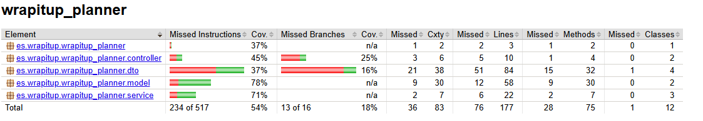
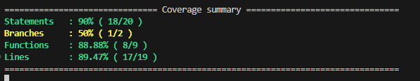
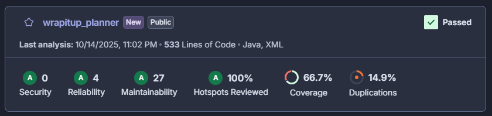
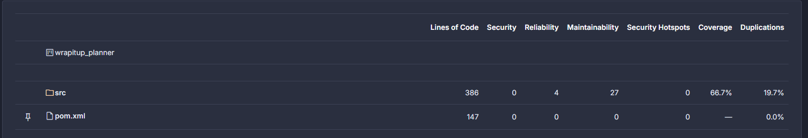

## Quality Control

To ensure the quality and reliability of WrapItUp Planner, different levels of testing were applied during the development of the application.  
The testing strategy covers both the **backend (server)** and the **frontend (client)** to guarantee the system works accordingly across all the different layers.

### 1. Server Tests

- **Unit Tests:**  
  Focused on verifying the functionality of backend services by themselves using database doubles (mocks). These tests ensure that individual components, such as service methods and certain data behave correctly under specific conditions.

- **Integration Tests:**  
  Performed by connecting the application to a real database to validate that repository interactions function as expected. These tests confirm that entities such as notes and users are correctly stored and retrieved from the database.

- **REST API Tests:**  
  Implemented using REST Assured, these tests validate that the REST API endpoints correctly retrieve and return example data from the system’s main entity. They ensure that the responses follow the expected structure, status codes, and content types.

### 2. Client Tests

- **Unit Tests:**  
  Designed to test individual Angular components using service doubles and a virtual DOM environment. These tests ensure that component logic and data rendering function properly in isolation.

- **Integration Tests:**  
  Connect the frontend with the real REST API to verify that data retrieved from the backend is correctly displayed on the user interface. They help ensure that communication between the client and server works as expected.

- **End-to-End (E2E) Tests:**  
  Conducted using **Karma**, **Jasmine**, and **Selenium**, these tests simulate real user interactions to validate the complete workflow of the application. They ensure that the user interface correctly displays data retrieved from the backend and that navigation, form submission, and content updates behave as expected under real browser conditions.

### Functional Coverage

The automated tests focus primarily on the Notes management (As of the end of fase 2) feature of WrapItUp Planner. Each test type ensures the correct behavior of specific functionalities:

- **Backend Tests:**  
  - Retrieval of Notes from the database 
  - Correct mapping to Data Transfer Objects (DTOs)  
  - Proper REST API responses for example notes

- **Frontend Tests:**  
  - Display of Note details in the user interface
  - Correct handling of route parameters and service responses
  - End-to-End process of viewing Notes
 
## Test Statistics

To ensure the quality of WrapItUp Planner, automated tests were executed at multiple levels for both backend and frontend.  

---

### Backend Tests (Java)

A total of **5 automated backend tests** were implemented so far:

*Example of test execution:*  

  

---

### Frontend Tests (Angular)

The frontend tests were performed using **Karma and Jasmine** to verify component behavior and integration with the REST API.  

  
*Figure 2: Karma and Jasmine test results showing passed frontend tests.*

---

### Backend Coverage (JaCoCo)

The **Java backend code coverage** was measured using **JaCoCo**, providing insight into which parts of the code were tested.

  
*Figure 3: JaCoCo report showing code coverage for the backend.*

---

### Frontend Coverage (Angular)

The frontend code coverage was generated using **Karma with the coverage reporter**. This report shows which components, methods, and lines were exercised by the tests, ensuring the reliability of the client-side application.

  
*Figure 4: Angular frontend coverage report showing lines, statements, functions, and branches covered.*

---

## Static Code Analysis

To ensure the quality, security, and maintainability of WrapItUp Planner, **SonarCloud** was used as a static code analysis tool. It analyzes the codebase to detect errors, vulnerabilities, and code smells, providing actionable insights to improve the project. The static code analysis is configured to run automatically on every Pull Request to the main branch, making sure that new changes meet quality standards before being merged.

---

### Analysis Results

The following captures summarize the results of the static code analysis as of the end of Phase 2:

  
*Figure 1: SonarCloud dashboard showing overall code quality, including ratings for Security, Reliability, and Maintainability.*

  
*Figure 2: SonarCloud measures showing the size of the codebase, including lines of code, number of classes, and methods.*

